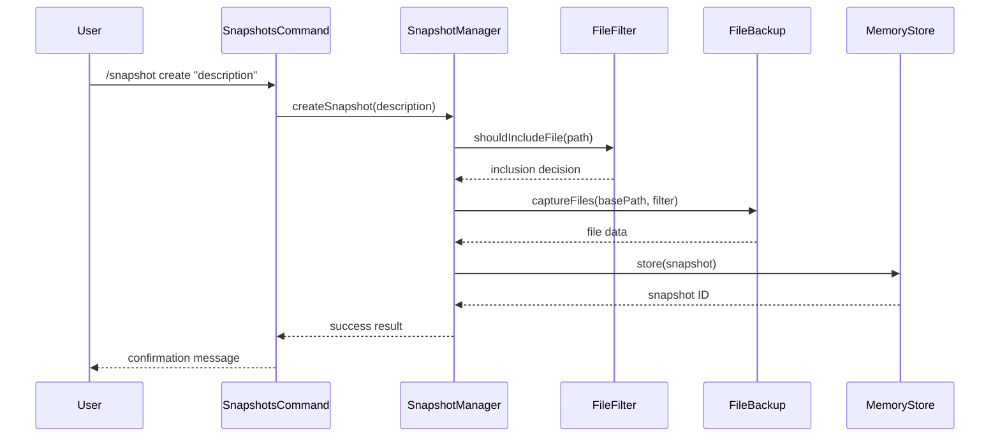
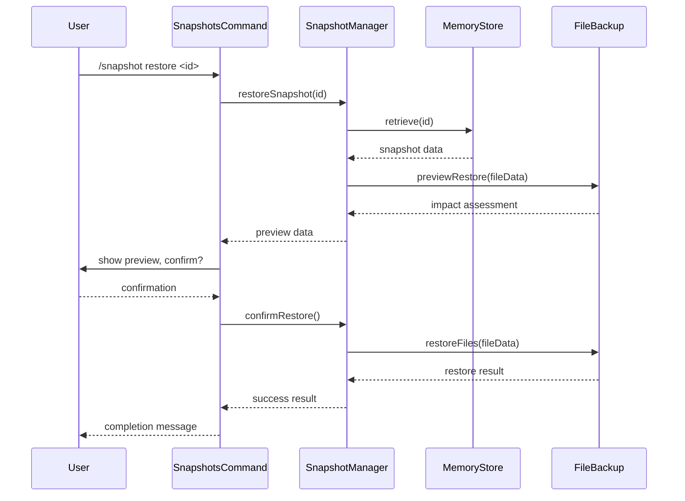

# Phase 1: Solution Architecture

## Overview

This document defines the technical architecture for Phase 1 of the snapshot system implementation, focusing on in-memory differential snapshots with checksum-based deduplication and restoration capabilities.

## Architecture Principles

- **Separation of Concerns**: Clear boundaries between storage, filtering, file capture, and command handling
- **Strategy Pattern**: Pluggable storage implementations (memory first, Git later)
- **Configuration-Driven**: Behavior controlled through configuration files following SynthDev patterns
- **Command Pattern**: Snapshot operations as discrete, reversible commands
- **Fail-Safe Design**: Robust error handling and recovery mechanisms

## System Components

### Core Components

#### SnapshotManager

**Location**: `src/core/snapshot/SnapshotManager.js`
**Responsibility**: Central orchestrator for all snapshot operations

```javascript
class SnapshotManager {
    constructor(store, fileBackup, fileFilter, config)

    // Core operations
    async createSnapshot(description, metadata = {})
    async listSnapshots()
    async restoreSnapshot(snapshotId, options = {})
    async deleteSnapshot(snapshotId)

    // Differential snapshot integration
    async createDifferentialSnapshot(toolName, files)

    // Configuration
    updateConfiguration(newConfig)
}
```

**Key Features**:

- Coordinates between storage, file capture, and filtering components
- Manages snapshot lifecycle and metadata
- Provides unified API for all snapshot operations
- Handles configuration updates and validation

#### MemorySnapshotStore

**Location**: `src/core/snapshot/stores/MemorySnapshotStore.js`
**Responsibility**: In-memory storage implementation

```javascript
class MemorySnapshotStore {
    constructor(config)

    async store(snapshot)
    async retrieve(snapshotId)
    async list()
    async delete(snapshotId)
    async exists(snapshotId)

    // Storage management
    getStorageStats()
    cleanup(criteria)
}
```

**Key Features**:

- Fast in-memory storage with configurable limits
- Snapshot metadata and file content storage
- Memory usage monitoring and cleanup
- Persistence across application sessions (optional)

#### FileBackup

**Location**: `src/core/snapshot/FileBackup.js`
**Responsibility**: File state capture and restoration

```javascript
class FileBackup {
    constructor(fileFilter, config)

    async captureFiles(basePath, options = {})
    async restoreFiles(fileData, options = {})
    async previewRestore(fileData)

    // Validation
    validateFileData(fileData)
    calculateRestoreImpact(fileData)
}
```

**Key Features**:

- Efficient file content capture with filtering
- Safe file restoration with checksum verification
- Preview mode for restore impact assessment
- Handles file permissions and metadata

#### FileFilter

**Location**: `src/core/snapshot/FileFilter.js`
**Responsibility**: File inclusion/exclusion logic

```javascript
class FileFilter {
    constructor(config)

    shouldIncludeFile(filePath, stats)
    shouldIncludeDirectory(dirPath, stats)

    // Pattern management
    addExclusionPattern(pattern)
    removeExclusionPattern(pattern)
    getActivePatterns()

    // Configuration
    updateConfiguration(filterConfig)
}
```

**Key Features**:

- Configurable exclusion patterns (glob, regex)
- File size and type filtering
- Directory traversal optimization
- Performance-optimized pattern matching

### Command Layer

#### SnapshotsCommand

**Location**: `src/commands/snapshots/SnapshotsCommand.js`
**Responsibility**: User interface following ADR-002 patterns

```javascript
class SnapshotsCommand extends InteractiveCommand {
    constructor(snapshotManager)

    async execute(args, context)

    // Subcommands
    async handleCreate(args, context)
    async handleList(args, context)
    async handleRestore(args, context)
    async handleDelete(args, context)
    async handleConfig(args, context)
}
```

**Key Features**:

- Follows ADR-002 command patterns
- Interactive prompts for complex operations
- Rich output formatting and user feedback
- Configuration management interface

### Configuration System

#### Snapshot Configuration

**Location**: `src/config/snapshots/`
**Files**:

- `snapshot-defaults.json` - Default settings and limits
- `file-filters.json` - Default exclusion patterns
- `snapshot-messages.json` - User interface messages

**Configuration Structure**:

```json
{
    "storage": {
        "maxSnapshots": 50,
        "maxMemoryMB": 100,
        "persistToDisk": false
    },
    "fileFiltering": {
        "defaultExclusions": ["node_modules/**", ".git/**", "dist/**", "build/**"],
        "maxFileSize": "10MB",
        "binaryFileHandling": "exclude"
    },
    "behavior": {
        "autoCleanup": true,
        "cleanupThreshold": 40,
        "confirmRestore": true,
        "showPreview": true
    }
}
```

## Data Flow Architecture

### Snapshot Creation Flow



### Snapshot Restoration Flow



## Component Interactions

### Dependency Graph

```
SnapshotsCommand
    ↓
SnapshotManager
    ↓ ↓ ↓
MemoryStore  FileBackup  FileFilter
                ↓
            FileFilter
```

### Configuration Dependencies

```
ConfigManager
    ↓
SnapshotConfig
    ↓ ↓ ↓
SnapshotManager  FileFilter  MemoryStore
```

## Error Handling Strategy

### Error Categories

1. **Configuration Errors**: Invalid config, missing files
2. **Storage Errors**: Memory limits, corruption
3. **File System Errors**: Permissions, disk space, missing files
4. **User Input Errors**: Invalid commands, missing parameters

### Error Recovery

- **Graceful Degradation**: Continue with reduced functionality
- **Automatic Retry**: For transient file system errors
- **User Notification**: Clear error messages with suggested actions
- **Logging**: Detailed error logging for debugging

### Validation Points

- Configuration validation on startup and updates
- File path validation before operations
- Snapshot data integrity checks
- Memory usage monitoring and limits

## Performance Considerations

### Memory Management

- Configurable memory limits for snapshot storage
- Lazy loading of snapshot content
- Automatic cleanup of old snapshots
- Memory usage monitoring and reporting

### File System Optimization

- Efficient directory traversal with early filtering
- Streaming file operations for large files
- Parallel file processing where safe
- Caching of file system metadata

### Scalability Limits

- Maximum 50 snapshots by default (configurable)
- Maximum 100MB memory usage (configurable)
- File size limits to prevent memory issues
- Directory depth limits for traversal

## Security Considerations

### File Access Control

- Respect file system permissions
- Validate file paths to prevent directory traversal
- Safe file restoration with checksum verification
- Temporary file cleanup

### Data Protection

- No sensitive data in configuration files
- Memory cleanup on application exit
- Secure handling of file content in memory
- Audit logging of snapshot operations

## Integration Points

### Existing SynthDev Systems

- **Configuration System**: Uses existing config patterns
- **Command System**: Follows ADR-002 command structure
- **Logging System**: Integrates with existing logger
- **Tool System**: Hooks into tool execution lifecycle

### Future Phase Preparation

- **Storage Abstraction**: Ready for Git storage implementation
- **Command Extension**: Prepared for additional subcommands
- **Configuration Extension**: Expandable for new features
- **API Stability**: Consistent interfaces for future enhancements
