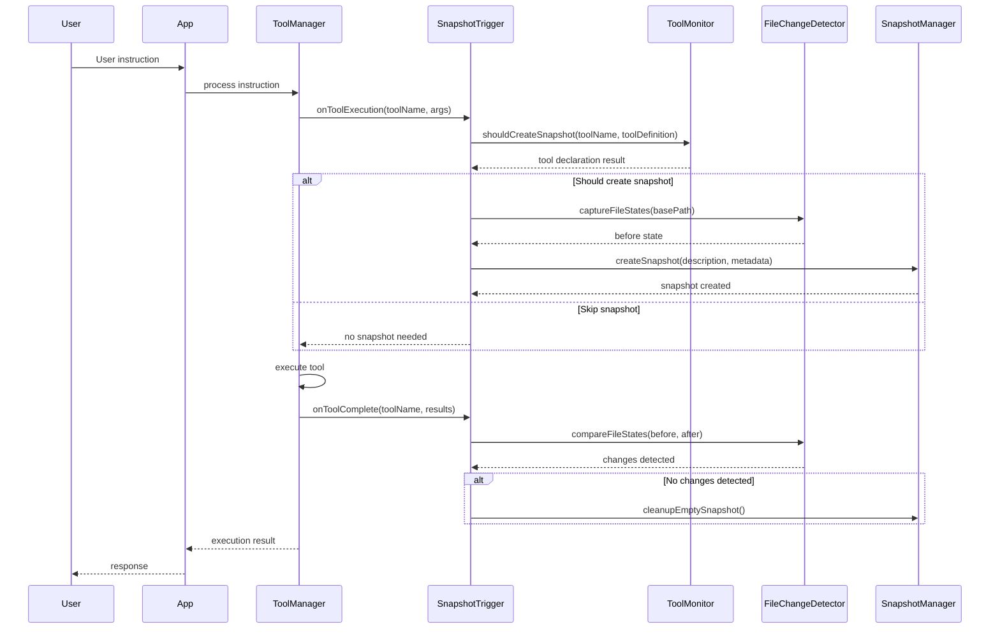
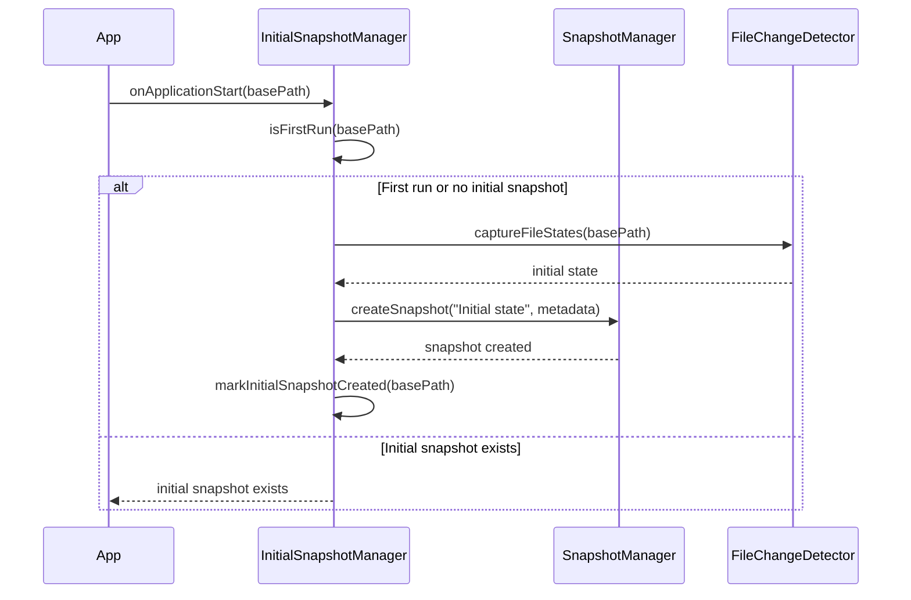
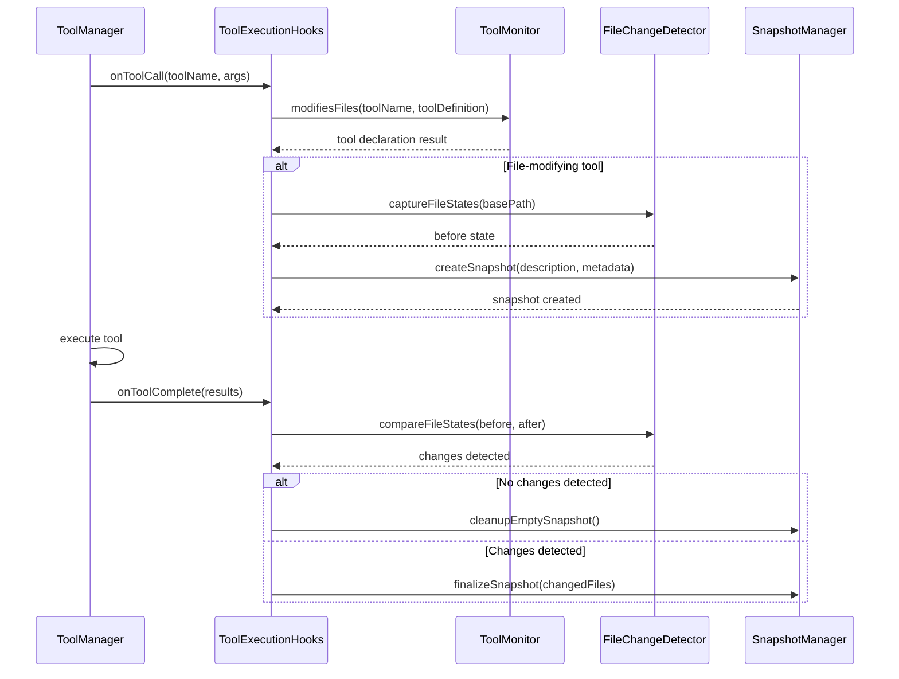

# Phase 2: Solution Architecture

## Overview

This document defines the technical architecture for Phase 2 of the snapshot system implementation, focusing on automatic snapshot creation triggered by deterministic tool execution events and file system monitoring, providing reliable protection before any file modifications occur.

## Architecture Principles

- **Event-Driven Design**: Snapshots triggered by deterministic tool execution events
- **Declaration-Based**: Tools declare their snapshot requirements in their definitions
- **Lifecycle Integration**: Seamless integration with existing tool execution workflow
- **Change Monitoring**: Monitor actual file changes and warn about unexpected modifications
- **Non-Intrusive**: Minimal impact on existing application flow and performance
- **Deterministic**: Reliable snapshot creation based on tool declarations and actual file changes

## System Components

### Core Components

#### ToolMonitor

**Location**: `src/core/snapshot/ToolMonitor.js`
**Responsibility**: Monitor tool execution based on tool declarations

```javascript
class ToolMonitor {
    constructor(toolManager, config)

    // Tool declaration checking
    shouldCreateSnapshot(toolName, toolDefinition)
    modifiesFiles(toolName, toolDefinition)
    getToolDeclaration(toolName)

    // Tool metadata
    getToolMetadata(toolName, args)
    extractFileTargets(toolName, args)

    // Validation
    validateToolDeclaration(toolDefinition)
    warnAboutMissingDeclaration(toolName)
}
```

**Key Features**:

- Simple declaration-based snapshot decisions using `modifiesFiles` flag
- Tool definition validation for `definition.json` files
- File target extraction from tool arguments
- Warning system for missing declarations
- Integration with existing tool system

#### SnapshotTrigger

**Location**: `src/core/snapshot/SnapshotTrigger.js`
**Responsibility**: Coordinate automatic snapshot creation based on tool execution

```javascript
class SnapshotTrigger {
    constructor(snapshotManager, toolMonitor, config)

    // Trigger management
    async processTrigger(toolName, args, context)
    async createTriggeredSnapshot(toolName, args, metadata)

    // Integration hooks
    async onToolExecution(toolName, args, context)
    async onExecutionComplete(toolName, results, context)
    async onApplicationStart(context)

    // Snapshot management
    generateSnapshotDescription(toolName, args)
    createToolMetadata(toolName, args, context)
    shouldSkipSnapshot(toolName, args, context)
}
```

**Key Features**:

- Automatic snapshot creation workflow
- Integration with ToolManager execution
- Smart description generation from tool execution
- Metadata capture for tool execution context
- Configurable trigger conditions based on tools

#### FileChangeDetector

**Location**: `src/core/snapshot/FileChangeDetector.js`
**Responsibility**: Monitor file system for actual file modifications and warn about unexpected changes

```javascript
class FileChangeDetector {
    constructor(config)

    // File monitoring methods
    captureFileStates(basePath)
    compareFileStates(beforeState, afterState)
    detectChanges(beforeSnapshot, afterSnapshot)
    getModifiedFiles(beforeState, afterState)

    // File state management
    getFileModificationTime(filePath)
    getFileChecksum(filePath)
    createFileStateSnapshot(basePath)

    // Change validation and warning
    validateActualChanges(toolName, args, detectedChanges)
    warnAboutUnexpectedChanges(toolName, declaredRequirement, actualChanges)
    shouldCreateSnapshot(detectedChanges)
}
```

**Key Features**:

- Deterministic file change detection
- File modification time monitoring
- Checksum-based change validation
- Before/after state comparison
- Warning system for unexpected file modifications
- Validation against tool declarations

#### InitialSnapshotManager

**Location**: `src/core/snapshot/InitialSnapshotManager.js`
**Responsibility**: Create initial "state 0" snapshot on application startup

```javascript
class InitialSnapshotManager {
    constructor(snapshotManager, config)

    // Initial snapshot management
    async createInitialSnapshot(basePath)
    async checkForInitialSnapshot(basePath)
    async shouldCreateInitialSnapshot(basePath)

    // State management
    isFirstRun(basePath)
    getInitialSnapshotId(basePath)
    markInitialSnapshotCreated(basePath)

    // Configuration
    getInitialSnapshotDescription(basePath)
    getInitialSnapshotMetadata(basePath)
}
```

**Key Features**:

- Automatic initial snapshot creation
- First-run detection
- State 0 establishment
- Configuration-driven behavior
- Metadata capture for initial state

### Integration Components

#### ToolManagerIntegration

**Location**: `src/core/snapshot/ToolManagerIntegration.js`
**Responsibility**: Integration hooks with the ToolManager execution flow

```javascript
class ToolManagerIntegration {
    constructor(snapshotTrigger, toolMonitor, config)

    // Integration methods
    integrateWithToolManager(toolManager)
    setupToolExecutionHooks(toolManager)
    setupApplicationStartupHooks(app)

    // Hook implementations
    async beforeToolExecution(toolName, args, context)
    async afterToolExecution(toolName, results, context)
    async onApplicationStart(context)

    // State management
    trackToolExecutionState(toolName, args, context)
    manageSnapshotSession(sessionId)
}
```

**Key Features**:

- Non-intrusive integration with ToolManager
- Tool execution lifecycle hooks
- Application startup hooks
- Session state management
- Minimal performance impact

#### ToolExecutionHooks

**Location**: `src/core/snapshot/ToolExecutionHooks.js`
**Responsibility**: Monitor tool execution for file modification detection

```javascript
class ToolExecutionHooks {
    constructor(snapshotManager, config)

    // Hook management
    registerHooks(toolManager)
    async onToolCall(toolName, args, context)
    async onToolComplete(toolName, results, context)
    async onToolError(toolName, error, context)

    // File modification detection
    detectFileModifications(toolName, args, results)
    trackFileChanges(beforeSnapshot, afterSnapshot)
    isFileModifyingTool(toolName)

    // Snapshot management
    async createPreExecutionSnapshot(toolName, args, context)
    async validateSnapshotNecessity(toolName, args)
}
```

**Key Features**:

- Tool-specific file modification detection
- Pre-execution differential snapshot creation
- File change tracking
- Smart snapshot validation
- Integration with existing tool system

### Configuration System

#### AutoSnapshot Configuration

**Location**: `src/config/snapshots/`
**Files**:

- `auto-snapshot-defaults.json` - Automatic snapshot settings
- `tool-declarations.json` - Tool snapshot requirement declarations
- `trigger-rules.json` - Trigger configuration
- `integration-settings.json` - App integration settings

**Configuration Structure**:

```json
{
    "autoSnapshot": {
        "enabled": true,
        "createOnToolExecution": true,
        "createInitialSnapshot": true,
        "verifyFileChanges": true,
        "warnOnUnexpectedChanges": true
    },
    "toolDeclarations": {
        "defaultModifiesFiles": false,
        "toolDefinitions": {
            "write_file": {
                "modifiesFiles": true
            },
            "edit_file": {
                "modifiesFiles": true
            },
            "read_file": {
                "modifiesFiles": false
            },
            "execute_script": {
                "modifiesFiles": true
            }
        }
    },
    "triggerRules": {
        "requireActualChanges": true,
        "maxSnapshotsPerSession": 20,
        "cooldownPeriod": 5000,
        "initialSnapshotTimeout": 30000
    },
    "descriptionGeneration": {
        "maxLength": 100,
        "includeToolName": true,
        "includeTargetFiles": true,
        "includeTimestamp": true
    },
    "fileChangeDetection": {
        "enabled": true,
        "useChecksums": true,
        "trackModificationTime": true,
        "minimumChangeSize": 1,
        "warnOnUnexpectedChanges": true
    }
}
```

## Data Flow Architecture

### Automatic Snapshot Creation Flow



### Initial Snapshot Creation Flow



### Tool Execution Integration Flow



## Component Interactions

### Dependency Graph

```
ToolManager
    ↓
ToolExecutionHooks
    ↓ ↓ ↓ ↓
SnapshotTrigger  ToolMonitor  FileChangeDetector  SnapshotManager
    ↓                              ↓
ToolMonitor                 (Phase 1 Components)
```

### Integration Points

```
Application
    ↓
InitialSnapshotManager
    ↓ ↓ ↓
FileChangeDetector  SnapshotManager  Configuration
```

### Configuration Dependencies

```
ConfigManager
    ↓
SnapshotConfig
    ↓ ↓ ↓ ↓
SnapshotTrigger  ToolMonitor  FileChangeDetector  SnapshotManager
```

## Integration with Existing Systems

### Application Integration

#### Integration Points

1. **Application Startup**: Hook into application startup for initial snapshots
2. **Tool Execution**: Integration with tool execution lifecycle
3. **Session Management**: Track tool execution sessions
4. **Error Handling**: Integrate with existing error handling

#### Implementation Strategy

```javascript
// In app.js - minimal changes required
class App {
    constructor() {
        // ... existing initialization
        this.snapshotIntegration = new ToolManagerIntegration(snapshotTrigger, toolMonitor, config);
        this.initialSnapshotManager = new InitialSnapshotManager(snapshotManager, config);
    }

    async initialize() {
        // ... existing initialization

        // Create initial snapshot
        await this.initialSnapshotManager.createInitialSnapshot(this.workingDirectory);

        // Integrate with ToolManager
        this.snapshotIntegration.integrateWithToolManager(this.toolManager);
    }
}
```

### Tool Manager Integration

#### Integration Points

1. **Tool Registration**: Register hooks during tool loading
2. **Execution Lifecycle**: Monitor tool execution phases
3. **File Modification Detection**: Track file changes
4. **Snapshot Management**: Coordinate with differential snapshot system

#### Implementation Strategy

```javascript
// In ToolManager - minimal changes required
class ToolManager {
    constructor() {
        // ... existing initialization
        this.executionHooks = new ToolExecutionHooks(snapshotManager, config);
        this.executionHooks.registerHooks(this);
    }

    async executeTool(toolCall, consoleInterface) {
        // Hook: before execution
        await this.executionHooks.onToolCall(toolCall.function.name, toolCall.function.arguments);

        // ... existing execution logic
        const result = await this.performToolExecution(toolCall, consoleInterface);

        // Hook: after execution
        await this.executionHooks.onToolComplete(toolCall.function.name, result);

        return result;
    }
}
```

## Tool Declaration System

### Tool Declaration Structure

#### Tool Definition Format

**Location**: `src/tools/[toolName]/definition.json`

```json
{
    "name": "write_file",
    "description": "Write content to a file",
    "modifiesFiles": true,
    "parameters": {
        "path": { "type": "string", "required": true },
        "content": { "type": "string", "required": true }
    }
}
```

#### Declaration Properties

**Required Properties**:

- `name` - Tool identifier
- `description` - Human-readable description
- `modifiesFiles` - Boolean indicating if tool modifies files (determines snapshot creation)
- `parameters` - Tool parameter definitions

**Optional Properties**:

- `fileTargets` - Array of file paths the tool will modify
- `snapshotPriority` - Priority level for snapshot creation
- `changeDetection` - Custom change detection rules

### Tool Declaration Logic

#### Simple Declaration Check

```javascript
function shouldCreateSnapshot(toolName, toolDefinition) {
    // Simple boolean check from tool definition
    return toolDefinition.modifiesFiles === true;
}
```

#### Change Validation

```javascript
function validateToolChanges(toolName, toolDefinition, actualChanges) {
    const expectedChanges = toolDefinition.modifiesFiles;
    const actuallyModified = actualChanges.length > 0;

    if (!expectedChanges && actuallyModified) {
        console.warn(`Tool ${toolName} made unexpected file changes`);
    }

    return { expectedChanges, actuallyModified };
}
```

## Performance Considerations

### Tool Declaration Processing Impact

- **Declaration Check**: <1ms for tool definition lookup
- **Snapshot Creation**: Asynchronous, non-blocking
- **Memory Usage**: Minimal additional memory overhead
- **Tool Execution**: <5% performance impact

### Optimization Strategies

#### Definition Caching

```javascript
class ToolMonitor {
    constructor(config) {
        this.declarationCache = new Map();
        this.definitionCache = new Map();
    }

    shouldCreateSnapshot(toolName, toolDefinition) {
        const cacheKey = toolName;

        if (this.declarationCache.has(cacheKey)) {
            return this.declarationCache.get(cacheKey);
        }

        const result = toolDefinition.modifiesFiles === true;
        this.declarationCache.set(cacheKey, result);

        return result;
    }
}
```

#### Batch Processing

```javascript
class SnapshotTrigger {
    async processTrigger(toolName, args, context) {
        // Batch multiple rapid tool executions
        if (this.isRapidSequence(toolName)) {
            this.queueForBatch(toolName, args, context);
            return;
        }

        return this.processImmediately(toolName, args, context);
    }
}
```

## Error Handling Strategy

### Error Categories

1. **Declaration Errors**: Missing tool definitions, invalid declaration format
2. **Integration Errors**: App.js integration issues, tool manager conflicts
3. **Snapshot Creation Errors**: Inherited from Phase 1 error handling
4. **Configuration Errors**: Invalid automatic snapshot configuration
5. **Change Detection Errors**: Unexpected file modifications, validation failures

### Error Recovery

#### Graceful Degradation

```javascript
class SnapshotTrigger {
    async processTrigger(toolName, args, context) {
        try {
            return await this.performTrigger(toolName, args, context);
        } catch (error) {
            this.logger.error('Snapshot trigger failed', error);

            // Graceful degradation: continue without snapshot
            this.notifyUser('Automatic snapshot creation failed, continuing without snapshot');
            return null;
        }
    }
}
```

#### Retry Logic

```javascript
class SnapshotTrigger {
    async createTriggeredSnapshot(instruction, metadata, retries = 3) {
        for (let i = 0; i < retries; i++) {
            try {
                return await this.snapshotManager.createSnapshot(
                    this.generateDescription(instruction),
                    metadata
                );
            } catch (error) {
                if (i === retries - 1) throw error;
                await this.delay(1000 * (i + 1)); // Exponential backoff
            }
        }
    }
}
```

## Security Considerations

### Instruction Analysis Safety

- **Input Validation**: Sanitize user instructions before processing
- **Pattern Matching**: Use safe regex patterns to prevent ReDoS attacks
- **Context Isolation**: Limit context information exposure
- **Audit Logging**: Log all automatic snapshot creation events

### Integration Security

- **Minimal Permissions**: Request only necessary permissions from app.js
- **Hook Validation**: Validate all integration hooks
- **Error Information**: Limit error information exposure
- **State Management**: Secure session state handling

## Future Phase Preparation

### Git Integration Readiness

- **Metadata Preservation**: Tool execution metadata ready for Git commit messages
- **Declaration Compatibility**: Tool declaration system compatible with Git-based workflows
- **Integration Hooks**: Prepared for Git-based snapshot storage

### Branch Management Preparation

- **Tool Analysis**: Tool declaration system ready for branch naming
- **Scope Detection**: File target identification ready for branch isolation
- **Workflow Integration**: Trigger system ready for branch-based workflows

## Configuration Migration

### Phase 1 Compatibility

- **Backward Compatibility**: All Phase 1 configurations remain valid
- **Gradual Migration**: Automatic snapshot features opt-in by default
- **Configuration Validation**: Extended validation for new settings
- **Default Behavior**: Conservative defaults to avoid disruption

### New Configuration Options

```json
{
    "snapshots": {
        "phase1": {
            // ... existing Phase 1 configuration
        },
        "phase2": {
            "autoSnapshot": {
                "enabled": true,
                "createOnToolExecution": true,
                "verifyFileChanges": true,
                "warnOnUnexpectedChanges": true
            },
            "toolDeclarations": {
                "defaultModifiesFiles": false,
                "customDeclarations": {}
            },
            "integration": {
                "appHooks": true,
                "toolHooks": true,
                "performance": {
                    "maxDeclarationTime": 1,
                    "batchingEnabled": true
                }
            }
        }
    }
}
```
