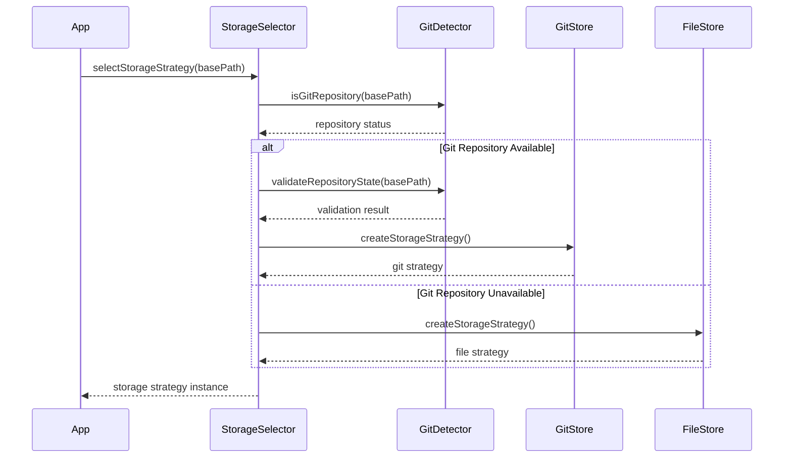
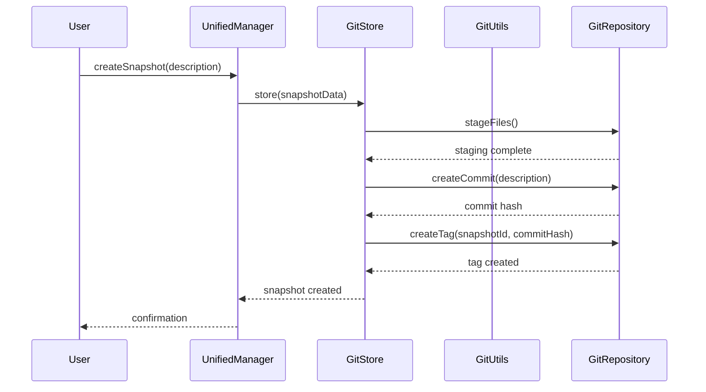
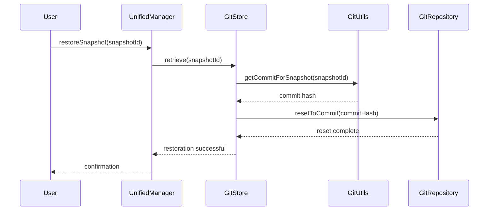
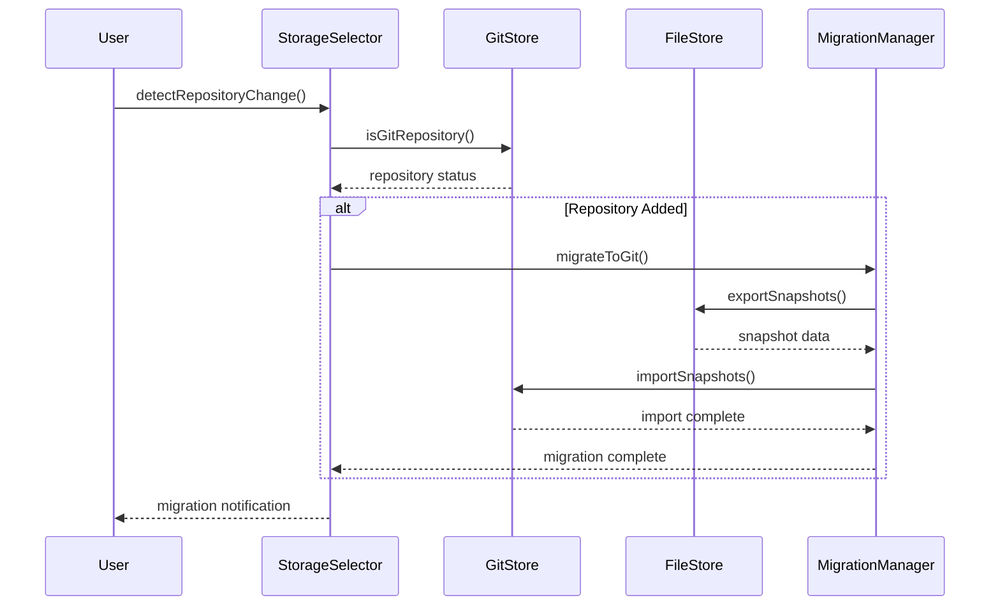

# Phase 3: Solution Architecture - Git Integration Foundation

## Overview

This document defines the technical architecture for Phase 3 of the snapshot system implementation, focusing on Git-based snapshot storage with intelligent fallback to file-based snapshots for non-Git projects. The architecture provides seamless integration with existing Git workflows while maintaining backward compatibility with Phase 1 and 2 functionality.

## Architecture Principles

- **Git-First Design**: Prioritize Git integration when repositories are available
- **Seamless Fallback**: Automatic transition to file-based storage for non-Git projects
- **Zero-Configuration**: No user intervention required for storage mode selection
- **Git Workflow Integration**: Leverage existing Git commands and workflows
- **Repository State Preservation**: Maintain clean Git history with snapshot commits
- **Deterministic Behavior**: Consistent storage mode selection based on repository state
- **Performance Optimization**: Minimal Git operation overhead

## System Components

### Core Components

#### GitSnapshotStore

**Location**: `src/core/snapshot/stores/GitSnapshotStore.js`
**Responsibility**: Git-based storage implementation using commits and tags

```javascript
class GitSnapshotStore {
    constructor(gitUtils, config)

    // Core storage operations
    async store(snapshot)
    async retrieve(snapshotId)
    async list()
    async delete(snapshotId)
    async exists(snapshotId)

    // Git-specific operations
    async createSnapshotCommit(snapshotData, metadata)
    async createSnapshotTag(commitHash, snapshotId, metadata)
    async restoreFromCommit(commitHash)
    async getCommitMetadata(commitHash)

    // Repository management
    async isGitRepository()
    async getCurrentBranch()
    async hasUncommittedChanges()
    async getRepositoryInfo()

    // Cleanup operations
    async cleanupSnapshotCommits(snapshotIds)
    async findOrphanedSnapshotTags()
}
```

**Key Features**:

- Git commit-based snapshot storage with rich metadata
- Lightweight Git tags for snapshot identification
- Atomic commit creation with file state capture
- Efficient commit restoration using Git reset
- Repository state validation and error handling
- Automatic cleanup of snapshot commits and tags

#### GitAvailabilityDetector

**Location**: `src/core/snapshot/GitAvailabilityDetector.js`
**Responsibility**: Detect Git availability and repository state

```javascript
class GitAvailabilityDetector {
    constructor(gitUtils, config)

    // Repository detection
    async isGitRepository(basePath)
    async getRepositoryType(basePath)
    async checkGitInstallation()
    async validateRepositoryState(basePath)

    // Repository health checks
    async hasValidGitConfig(basePath)
    async canCreateCommits(basePath)
    async hasWritePermissions(basePath)

    // Fallback determination
    async shouldUseGitStorage(basePath)
    async getStorageMode(basePath)
    async getFallbackReason(basePath)

    // Performance optimization
    async isRepositoryCached(basePath)
    async invalidateRepositoryCache(basePath)
}
```

**Key Features**:

- Comprehensive Git repository detection
- Repository health validation
- Performance-optimized caching
- Clear fallback reasoning
- Cross-platform Git installation detection

#### GitMetadataExtractor

**Location**: `src/core/snapshot/GitMetadataExtractor.js`
**Responsibility**: Extract and format Git metadata for snapshots

```javascript
class GitMetadataExtractor {
    constructor(gitUtils)

    // Commit metadata extraction
    async extractCommitMetadata(commitHash)
    async getCommitDiff(commitHash)
    async getChangedFiles(commitHash)
    async getAuthorInfo(commitHash)

    // Repository metadata
    async getRepositoryMetadata()
    async getBranchInfo()
    async getRemoteInfo()
    async getStashInfo()

    // Snapshot correlation
    async correlateSnapshotWithCommit(snapshotId, commitHash)
    async findSnapshotCommits()
    async validateSnapshotIntegrity(snapshotId, commitHash)
}
```

**Key Features**:

- Rich Git metadata extraction
- Commit diff analysis
- File change tracking
- Repository state correlation
- Snapshot integrity validation

#### GitSnapshotCleanup

**Location**: `src/core/snapshot/GitSnapshotCleanup.js`
**Responsibility**: Clean up Git-based snapshots and maintain repository hygiene

```javascript
class GitSnapshotCleanup {
    constructor(gitUtils, config)

    // Snapshot cleanup
    async cleanupSnapshot(snapshotId)
    async cleanupOrphanedSnapshots()
    async cleanupOldSnapshots(criteria)

    // Repository maintenance
    async pruneSnapshotCommits()
    async optimizeRepositorySize()
    async validateRepositoryHealth()

    // Safety checks
    async validateCleanupSafety(snapshotId)
    async createCleanupBackup()
    async restoreFromCleanupBackup()
}
```

**Key Features**:

- Safe snapshot cleanup with validation
- Repository size optimization
- Orphaned snapshot detection
- Cleanup rollback capabilities
- Repository health monitoring

### Integration Components

#### StorageStrategySelector

**Location**: `src/core/snapshot/StorageStrategySelector.js`
**Responsibility**: Dynamic storage strategy selection based on repository state

```javascript
class StorageStrategySelector {
    constructor(gitDetector, config)

    // Strategy selection
    async selectStorageStrategy(basePath)
    async validateStrategyChange(currentStrategy, newStrategy)
    async getStrategyCapabilities(strategy)

    // Strategy management
    async createStorageStrategy(strategyType)
    async migrateBetweenStrategies(fromStrategy, toStrategy)
    async getStrategyStatus()

    // Fallback handling
    async handleStrategyFallback(currentStrategy, fallbackReason)
    async notifyUserOfStrategyChange(oldStrategy, newStrategy)
}
```

**Key Features**:

- Intelligent storage strategy selection
- Seamless strategy migration
- User notification for strategy changes
- Fallback handling with clear reasoning
- Strategy capability validation

#### UnifiedSnapshotManager

**Location**: `src/core/snapshot/UnifiedSnapshotManager.js`
**Responsibility**: Unified interface for Git and file-based snapshots

```javascript
class UnifiedSnapshotManager {
    constructor(storageSelector, gitStore, fileStore, config)

    // Unified operations
    async createSnapshot(description, metadata = {})
    async listSnapshots()
    async restoreSnapshot(snapshotId, options = {})
    async deleteSnapshot(snapshotId)

    // Storage management
    async getCurrentStorageMode()
    async switchStorageMode(newMode)
    async getStorageCapabilities()

    // Migration support
    async migrateSnapshots(fromMode, toMode)
    async validateMigration(sourceMode, targetMode)
}
```

**Key Features**:

- Transparent storage mode switching
- Unified API regardless of storage backend
- Migration support between storage modes
- Storage capability abstraction
- Configuration-driven behavior

### Configuration System

#### Git Integration Configuration

**Location**: `src/config/snapshots/`
**Files**:

- `git-integration-defaults.json` - Git-specific settings
- `git-cleanup-policies.json` - Cleanup configuration
- `repository-detection.json` - Repository detection settings
- `git-messages.json` - Git-related UI messages

**Configuration Structure**:

```json
{
    "gitIntegration": {
        "enabled": true,
        "autoDetect": true,
        "storageMode": "auto",
        "repositoryValidation": {
            "checkGitInstallation": true,
            "validateRepositoryState": true,
            "requireCleanWorkingDirectory": false,
            "checkWritePermissions": true
        },
        "snapshotCommit": {
            "format": "SNAPSHOT: {description} [{timestamp}]",
            "authorName": "SynthDev",
            "authorEmail": "synthdev@system",
            "signCommits": false,
            "includeMetadata": true
        },
        "cleanup": {
            "autoCleanup": true,
            "maxSnapshotCommits": 100,
            "cleanupThreshold": 50,
            "retentionPeriod": "30d",
            "backupBeforeCleanup": true
        },
        "performance": {
            "enableCaching": true,
            "cacheTimeout": 300000,
            "maxCacheSize": 50
        }
    }
}
```

## Data Flow Architecture

### Storage Strategy Selection Flow



### Git-based Snapshot Creation Flow



### Snapshot Restoration Flow



### Repository Migration Flow



## Component Interactions

### Dependency Graph

```
UnifiedSnapshotManager
    ↓ ↓
StorageStrategySelector  GitSnapshotStore
    ↓ ↓ ↓
GitAvailabilityDetector  GitUtils  Configuration
    ↓
GitMetadataExtractor
    ↓
GitSnapshotCleanup
```

### Configuration Dependencies

```
ConfigManager
    ↓
SnapshotConfig
    ↓ ↓ ↓ ↓
GitStore  GitDetector  StorageSelector  UnifiedManager
```

## Error Handling Strategy

### Error Categories

1. **Repository Detection Errors**: Git not installed, invalid repository
2. **Git Operation Errors**: Commit failures, permission issues, conflicts
3. **Storage Mode Errors**: Strategy selection failures, migration issues
4. **Configuration Errors**: Invalid Git settings, repository constraints
5. **Migration Errors**: Data loss during strategy switching

### Error Recovery

#### Repository Detection Failure

```javascript
class GitAvailabilityDetector {
    async handleDetectionFailure(basePath, error) {
        const fallback = {
            useGitStorage: false,
            reason: 'Git detection failed',
            details: error.message,
            fallbackToFile: true,
        };

        this.logger.warn('Git detection failed, using file storage', fallback);
        return fallback;
    }
}
```

#### Git Operation Failure

```javascript
class GitSnapshotStore {
    async handleGitOperationFailure(operation, error) {
        const recovery = {
            operationFailed: operation,
            error: error.message,
            recoveryAction: 'fallback_to_file_storage',
            userNotification: 'Git operation failed, switching to file storage',
        };

        await this.notifyStorageFallback(recovery);
        return recovery;
    }
}
```

#### Migration Failure

```javascript
class StorageStrategySelector {
    async handleMigrationFailure(fromStrategy, toStrategy, error) {
        const rollback = {
            from: fromStrategy,
            to: toStrategy,
            error: error.message,
            action: 'rollback_to_previous',
            dataPreserved: true,
        };

        await this.rollbackMigration(fromStrategy, toStrategy);
        return rollback;
    }
}
```

## Performance Considerations

### Git Operation Optimization

#### Repository State Caching

```javascript
class GitAvailabilityDetector {
    constructor(config) {
        this.repositoryCache = new Map();
        this.cacheTimeout = config.cacheTimeout || 300000; // 5 minutes
    }

    async isGitRepository(basePath) {
        const cacheKey = basePath;
        const cached = this.repositoryCache.get(cacheKey);

        if (cached && Date.now() - cached.timestamp < this.cacheTimeout) {
            return cached.result;
        }

        const result = await this.performGitCheck(basePath);
        this.repositoryCache.set(cacheKey, {
            result,
            timestamp: Date.now(),
        });

        return result;
    }
}
```

#### Commit Optimization

```javascript
class GitSnapshotStore {
    async optimizeCommitCreation(snapshotData) {
        // Only commit changed files
        const changedFiles = await this.detectChangedFiles();
        if (changedFiles.length === 0) {
            return null; // Skip empty commits
        }

        // Batch similar operations
        return this.createOptimizedCommit(changedFiles, snapshotData);
    }
}
```

### Memory Management

#### Git Object Caching

```javascript
class GitMetadataExtractor {
    constructor(config) {
        this.commitCache = new LRUCache({
            max: config.maxCacheSize || 50,
            ttl: config.cacheTimeout || 300000,
        });
    }

    async getCommitMetadata(commitHash) {
        if (this.commitCache.has(commitHash)) {
            return this.commitCache.get(commitHash);
        }

        const metadata = await this.extractCommitMetadata(commitHash);
        this.commitCache.set(commitHash, metadata);
        return metadata;
    }
}
```

### Scalability Limits

- **Maximum Commits**: 1000 snapshot commits per repository (configurable)
- **Repository Size**: Optimized for repositories up to 1GB
- **Snapshot Frequency**: Maximum 1 snapshot per second per repository
- **Concurrent Operations**: Thread-safe Git operations

## Security Considerations

### Repository Security

#### Access Control Validation

```javascript
class GitAvailabilityDetector {
    async validateRepositoryAccess(basePath) {
        const checks = [
            this.hasReadPermissions(basePath),
            this.hasWritePermissions(basePath),
            this.hasValidGitConfig(basePath),
            this.isNotBareRepository(basePath),
        ];

        const results = await Promise.all(checks);
        return results.every(result => result === true);
    }
}
```

#### Safe Git Operations

```javascript
class GitSnapshotStore {
    async performSafeGitOperation(operation, args) {
        // Validate operation safety
        if (!this.isOperationSafe(operation, args)) {
            throw new Error(`Unsafe Git operation: ${operation}`);
        }

        // Backup current state
        const backup = await this.createStateBackup();

        try {
            return await this.executeGitOperation(operation, args);
        } catch (error) {
            await this.restoreFromBackup(backup);
            throw error;
        }
    }
}
```

### Data Protection

#### Sensitive Information Handling

- **No sensitive data in commits**: Filter out API keys, tokens, passwords
- **Secure metadata storage**: Store metadata separately from file content
- **Repository isolation**: Prevent cross-repository contamination
- **Audit logging**: Track all Git operations for security review

## Integration with Existing Systems

### Phase 1 and 2 Compatibility

#### Backward Compatibility Layer

```javascript
class UnifiedSnapshotManager {
    async migrateFromPhase2(phase2Data) {
        const migration = {
            memorySnapshots: this.migrateMemorySnapshots(phase2Data),
            fileSnapshots: this.migrateFileSnapshots(phase2Data),
            gitSnapshots: this.initializeGitSnapshots(),
        };

        await this.validateMigration(migration);
        return migration;
    }
}
```

#### Configuration Migration

```javascript
class SnapshotConfig {
    async migratePhase2Config(phase2Config) {
        const phase3Config = {
            ...phase2Config,
            gitIntegration: {
                enabled: true,
                storageMode: 'auto',
                migration: {
                    preservePhase2Snapshots: true,
                    cleanupAfterMigration: false,
                },
            },
        };

        return phase3Config;
    }
}
```

### Future Phase Preparation

#### Branch Management Readiness

- **Branch detection**: Repository branch analysis ready for Phase 4
- **Commit message templates**: Prepared for feature branch naming
- **Repository state tracking**: Ready for branch-based workflows
- **Migration framework**: Established for future storage mode changes

#### Advanced Git Features

- **Stash integration**: Ready for stash-based snapshots
- **Rebase support**: Prepared for history rewriting scenarios
- **Remote repository handling**: Framework for remote operations
- **Submodule support**: Architecture for complex repository structures

## Configuration Migration

### Phase 2 Compatibility

#### Automatic Migration

```json
{
    "snapshots": {
        "phase2": {
            // ... existing Phase 2 configuration
        },
        "phase3": {
            "gitIntegration": {
                "enabled": true,
                "autoDetect": true,
                "fallbackToFile": true,
                "repositoryValidation": {
                    "checkInstallation": true,
                    "validateState": true,
                    "requireCleanState": false
                }
            },
            "migration": {
                "autoMigrate": true,
                "preserveExisting": true,
                "cleanupAfterMigration": false
            }
        }
    }
}
```

This architecture provides a robust foundation for Git integration while maintaining full compatibility with existing functionality and preparing for future advanced Git features.
