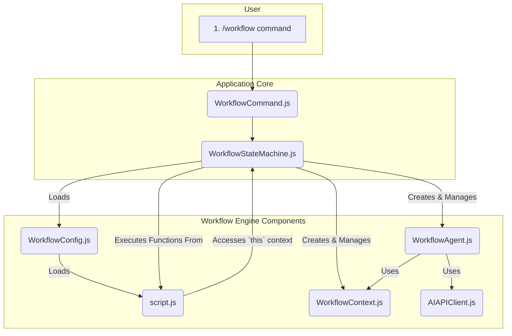

# Current Workflow System Architecture

This document outlines the current, as-is architecture of the SynthDev multi-agent workflow system. Its purpose is to establish a shared understanding of the existing components and their interactions before proposing any modifications.

## 1. Core Components

The system is comprised of four main classes that work together to execute a workflow.

### `WorkflowConfig.js`

- **Responsibility:** Loading, parsing, and validating a workflow's configuration.
- **Process:**
    1.  Reads a specific workflow's `.json` file from `src/config/workflows/`.
    2.  Parses the JSON content.
    3.  Validates that all required fields (`workflow_name`, `agents`, `states`, etc.) are present and correctly structured.
    4.  Dynamically loads the corresponding `script.js` file from the associated sub-directory (e.g., `src/config/workflows/my_workflow/script.js`). The exported functions from this script are stored as the `scriptModule`.

### `WorkflowContext.js`

- **Responsibility:** Managing the shared conversational history for a group of agents.
- **Process:**
    1.  Is initialized with a configuration that includes a name, optional starting messages, and a max length.
    2.  Maintains a `messages` array, which is the single source of truth for the conversation.
    3.  Provides a crucial method, `getMessagesForAgent(agentId)`, which returns the message history from the perspective of a specific agent. It correctly reverses the `user` and `assistant` roles for agents configured with `role: 'user'`.

### `WorkflowAgent.js`

- **Responsibility:** Representing a single AI agent within the workflow.
- **Process:**
    1.  Is initialized with a specific `agent_role` (e.g., "coder") and linked to a `WorkflowContext` instance.
    2.  Creates its own dedicated `AIAPIClient` instance, configured with the appropriate model and tools for its role.
    3.  The primary method used by the state machine is `makeContextCall()`. This method fetches the latest messages from its `WorkflowContext`, sends them to the AI API, and captures the response.
    4.  The raw API response is stored in `this.lastRawResponse` for the state machine to access.

### `WorkflowStateMachine.js`

- **Responsibility:** The central orchestrator that executes the entire workflow from start to finish.
- **Key Properties:**
    - `common_data`: A JavaScript object that acts as a shared key-value store for the entire workflow execution. It holds workflow variables and any data passed between states.
    - `scriptContext`: An object that is passed as `this` to all executed script functions. It provides access to `common_data`, `workflow_contexts`, the `last_response`, and the initial `input`.

## 2. Execution Lifecycle & Data Flow

The current system follows a synchronous, "fire-and-forget" execution model.

1.  **Initiation:**

    - The user runs the `/workflow <name> "<input>"` command.
    - `WorkflowCommand.js` receives the command, prompts the user for the defined input parameter, and then calls `workflowStateMachine.executeWorkflow(workflowName, inputParams)`.

2.  **Initialization (`_initializeWorkflow`):**

    - The `WorkflowStateMachine` resets its state (clears contexts, agents, common_data).
    - It loads the specified `WorkflowConfig`.
    - It creates all defined `WorkflowContext` and `WorkflowAgent` instances.
    - It populates `common_data` with any global `variables` defined in the config.
    - Crucially, it places the user's initial input (`inputParams`) into `common_data` using the key defined in the workflow's `input` object (e.g., `common_data.initial_customer_request = "..."`).

3.  **State Machine Execution (`_executeStateMachine`):**

    - The machine enters a blocking `while` loop that continues until the current state is "stop".
    - In each iteration, it calls `_executeState` for the current state.

4.  **State Execution (`_executeState`):**

    - This method follows a strict 4-step pattern for the state's designated agent:
        1.  **Pre-Handler:** If a `pre_handler` function name is defined for the state, it is executed. This script function typically prepares the `WorkflowContext` by adding a new message for the agent to process, often using data from `common_data`.
        2.  **Agent Call:** The state machine calls the agent's `makeContextCall()` method. The agent sends the context to the AI and receives a response.
        3.  **Post-Handler:** If a `post_handler` is defined, it is executed. This script function processes the agent's response (available in `this.last_response`) and typically updates `common_data` or the `WorkflowContext` with the results.
        4.  **Transition-Handler:** If a `transition_handler` is defined, it is executed. This script function's sole purpose is to return a string containing the name of the next state to transition to.

5.  **Completion:**
    - When a state transition returns "stop", the `while` loop terminates.
    - The final result of the workflow is retrieved from `common_data`, using the key defined in the workflow's `output` object.
    - The result is returned to the `WorkflowCommand`, which displays it to the user.

## 3. Architectural Diagram

## 4. Summary of Key Concepts

- **Synchronous Execution:** The entire workflow runs to completion within a single, blocking call to `executeWorkflow`.
- **State-Driven:** The workflow's flow is explicitly controlled by states and the transition logic defined in the script functions.
- **`common_data` as Memory:** The `common_data` object is the primary mechanism for maintaining state and passing information between different agents and states.
- **Script-Centric Logic:** All the dynamic logic—preparing agent prompts, processing results, and deciding transitions—is handled by JavaScript functions in the `script.js` file, not by the state machine itself.
- **Decoupled Context:** Agents do not talk to each other directly. They interact by reading from and writing to a shared `WorkflowContext` instance, with the `WorkflowStateMachine` orchestrating the turn-taking.
