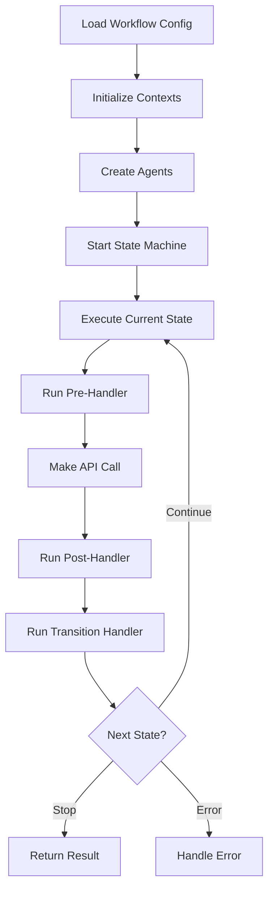
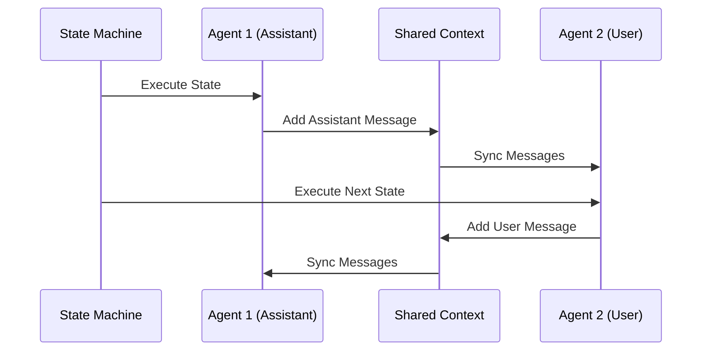

# Workflow System Guide

This comprehensive guide covers SynthDev's advanced multi-agent workflow system, which enables complex interactions between multiple AI agents with shared context and state management.

## Overview

SynthDev's workflow system provides:

- **🤖 Multi-Agent Orchestration**: Multiple AI agents with different roles working together
- **🔄 State Machine Execution**: Structured workflow execution with defined states and transitions
- **💬 Shared Context Management**: Agents share conversation context with role-based message mapping
- **📝 Custom Script Integration**: JavaScript functions for complex workflow logic
- **🎯 Parsing Tools**: Structured output handling for decision-making
- **📊 Execution Tracking**: Detailed logging and state history

## Quick Start

### Running a Workflow

```bash
# List available workflows
/workflows

# Execute a workflow
/workflow grocery_store_test
```

### Basic Workflow Structure

```
config/workflows/
├── my_workflow.json          # Workflow configuration
└── my_workflow/              # Workflow scripts directory
    └── script.js             # Custom JavaScript functions
```

## Workflow Configuration

### Basic Configuration Structure

```json
{
    "workflow_name": "my_workflow",
    "description": "Description of what this workflow does",
    "input": {
        "name": "user_input",
        "type": "string",
        "description": "Input parameter description"
    },
    "output": {
        "name": "workflow_result",
        "type": "string",
        "description": "Output description"
    },
    "variables": {
        "max_iterations": 10,
        "custom_setting": "value"
    },
    "contexts": [
        {
            "name": "shared_conversation",
            "starting_messages": [],
            "max_length": 30000
        }
    ],
    "agents": [
        {
            "agent_role": "coder",
            "context": "shared_conversation",
            "role": "assistant"
        },
        {
            "agent_role": "reviewer",
            "context": "shared_conversation",
            "role": "user"
        }
    ],
    "states": [
        {
            "name": "start",
            "agent": "coder",
            "pre_handler": "setupInitialContext",
            "post_handler": "processCoderResponse",
            "transition_handler": "decideNextState"
        },
        {
            "name": "stop",
            "input": "common_data.workflow_result"
        }
    ]
}
```

### Configuration Properties

#### **Workflow Metadata**

- `workflow_name`: Unique identifier for the workflow
- `description`: Human-readable description
- `input`: Input parameter definition with name, type, and description
- `output`: Output parameter definition
- `variables`: Initial workflow variables (optional)

#### **Contexts**

Define shared conversation spaces for agents:

```json
"contexts": [
    {
        "name": "context_name",
        "starting_messages": [
            {
                "role": "system",
                "content": "Initial system message"
            }
        ],
        "max_length": 50000
    }
]
```

#### **Agents**

Define AI agents participating in the workflow:

```json
"agents": [
    {
        "agent_role": "role_name",     // Must match a role in roles.json
        "context": "context_name",     // Context this agent uses
        "role": "assistant"            // "user" or "assistant" in context
    }
]
```

**Agent Role Mapping:**

- `role: "assistant"`: Agent's messages appear as assistant messages in context
- `role: "user"`: Agent's messages appear as user messages in context

#### **States**

Define workflow execution states:

```json
"states": [
    {
        "name": "state_name",
        "agent": "agent_role",                    // Agent to execute
        "pre_handler": "function_name",           // Before API call (optional)
        "post_handler": "function_name",          // After API call (optional)
        "transition_handler": "function_name"     // Decide next state (optional)
    }
]
```

**Special States:**

- `start`: Required initial state
- `stop`: Terminal state (can specify output with `input` property)

## Script Functions

### Script File Structure

Create `config/workflows/workflow_name/script.js`:

```javascript
export default {
    // Pre-handler: Modify context before API call
    setupInitialContext() {
        const context = this.workflow_contexts.get('shared_conversation');
        context.addMessage({
            role: 'user',
            content: this.common_data.user_input,
        });
    },

    // Post-handler: Process API response
    processResponse() {
        const responseContent = this.last_response?.choices?.[0]?.message?.content;
        if (responseContent) {
            this.common_data.agent_response = responseContent;
        }
    },

    // Transition-handler: Decide next state
    decideNextState() {
        const toolCalls = this.last_response?.choices?.[0]?.message?.tool_calls || [];

        if (toolCalls.length > 0) {
            return 'process_tools';
        }
        return 'stop';
    },
};
```

### Script Context

Script functions have access to `this` context containing:

```javascript
{
    common_data: {},                    // Shared workflow variables
    last_response: {},                  // Raw API response from last agent call
    workflow_contexts: Map,             // Map of WorkflowContext instances
    input: "user_input_value"          // Input parameters
}
```

### Common Script Patterns

#### **Adding Messages to Context**

```javascript
addUserMessage() {
    const context = this.workflow_contexts.get('conversation');
    context.addMessage({
        role: 'user',
        content: this.common_data.user_request
    });
}
```

#### **Processing Tool Calls**

```javascript
processToolCall() {
    const toolCalls = this.last_response?.choices?.[0]?.message?.tool_calls || [];
    const decisionCall = toolCalls.find(call => call.function?.name === 'make_decision');

    if (decisionCall) {
        const args = JSON.parse(decisionCall.function.arguments);
        this.common_data.decision = args.decision;
    }
}
```

#### **Conditional State Transitions**

```javascript
decideNextAction() {
    const args = this._parseToolCall('action_decision');

    if (args?.continue === true) {
        return 'continue_workflow';
    } else {
        this.common_data.final_result = args?.summary;
        return 'stop';
    }
}
```

## Parsing Tools

### Role Configuration with Parsing Tools

```json
{
    "decision_maker": {
        "level": "fast",
        "systemMessage": "You make decisions and provide structured output.",
        "parsingTools": [
            {
                "type": "function",
                "function": {
                    "name": "make_decision",
                    "description": "Make a structured decision",
                    "parameters": {
                        "type": "object",
                        "properties": {
                            "continue": {
                                "type": "boolean",
                                "description": "Whether to continue the workflow"
                            },
                            "reason": {
                                "type": "string",
                                "description": "Reason for the decision"
                            }
                        },
                        "required": ["continue"]
                    }
                },
                "parsingOnly": true
            }
        ]
    }
}
```

### Processing Parsing Tool Calls

```javascript
processDecision() {
    const toolCalls = this.last_response?.choices?.[0]?.message?.tool_calls || [];
    const decisionCall = toolCalls.find(call => call.function?.name === 'make_decision');

    if (decisionCall) {
        try {
            const decision = JSON.parse(decisionCall.function.arguments);
            this.common_data.should_continue = decision.continue;
            this.common_data.decision_reason = decision.reason;
        } catch (error) {
            console.error('Error parsing decision:', error);
        }
    }
}
```

## Advanced Features

### Multi-Context Workflows

```json
"contexts": [
    {
        "name": "planning_context",
        "starting_messages": [],
        "max_length": 20000
    },
    {
        "name": "execution_context",
        "starting_messages": [],
        "max_length": 30000
    }
],
"agents": [
    {
        "agent_role": "architect",
        "context": "planning_context",
        "role": "assistant"
    },
    {
        "agent_role": "coder",
        "context": "execution_context",
        "role": "assistant"
    }
]
```

### Complex State Transitions

```javascript
// Helper function to parse tool calls
_parseToolCall(toolName) {
    const toolCalls = this.last_response?.choices?.[0]?.message?.tool_calls || [];
    const call = toolCalls.find(c => c.function?.name === toolName);

    if (call) {
        try {
            return JSON.parse(call.function.arguments);
        } catch (error) {
            return null;
        }
    }
    return null;
},

// Complex transition logic
decideWorkflowPath() {
    const decision = this._parseToolCall('workflow_decision');

    if (!decision) {
        return 'error_state';
    }

    switch (decision.action) {
        case 'review':
            return 'review_state';
        case 'implement':
            return 'implementation_state';
        case 'complete':
            this.common_data.final_output = decision.summary;
            return 'stop';
        default:
            return 'clarification_state';
    }
}
```

### Variable Management

```javascript
// Initialize workflow variables
initializeWorkflow() {
    this.common_data.iteration_count = 0;
    this.common_data.max_iterations = 5;
    this.common_data.results = [];
},

// Track progress
trackProgress() {
    this.common_data.iteration_count++;

    if (this.common_data.iteration_count >= this.common_data.max_iterations) {
        this.common_data.final_result = 'Maximum iterations reached';
        return 'stop';
    }

    return 'continue_iteration';
}
```

## Best Practices

### Workflow Design

1. **Clear State Purpose**: Each state should have a single, well-defined purpose
2. **Minimal Context**: Keep shared context focused and relevant
3. **Error Handling**: Include error states and validation
4. **Iteration Limits**: Prevent infinite loops with maximum iteration counts

### Script Organization

1. **Function Naming**: Use descriptive names that indicate the handler type
2. **Error Handling**: Wrap JSON parsing and API access in try-catch blocks
3. **Logging**: Use console.log for debugging (visible in workflow execution)
4. **Helper Functions**: Create reusable helper functions for common operations

### Agent Configuration

1. **Role Selection**: Choose appropriate AI roles for each agent's purpose
2. **Context Mapping**: Carefully consider whether agents should be "user" or "assistant" in context
3. **Tool Access**: Ensure agents have appropriate tools for their tasks
4. **Parsing Tools**: Use parsing tools for structured decision-making

### Performance Optimization

1. **Context Length**: Set appropriate max_length for contexts to manage token usage
2. **State Efficiency**: Minimize unnecessary state transitions
3. **Tool Filtering**: Use role-based tool filtering to reduce API payload size
4. **Caching**: Store computed results in common_data to avoid recomputation

## Troubleshooting

### Common Issues

**Workflow Not Found**

```bash
❌ Workflow 'my_workflow' not found
💡 Use /workflows to see available workflows
```

- Check workflow file exists in `config/workflows/`
- Verify `workflow_name` matches filename

**Script Function Not Found**

```
Function not found in script module: myFunction
```

- Ensure function is exported in `script.js`
- Check function name spelling in workflow configuration

**Agent Role Not Found**

```
Unknown agent: my_role
```

- Verify role exists in `config/roles/roles.json`
- Check agent_role spelling in workflow configuration

**Context Validation Error**

```
Agent my_agent: references unknown context my_context
```

- Ensure context is defined in contexts array
- Check context name spelling in agent configuration

### Debugging Workflows

1. **Enable Debug Logging**: Set verbosity level to see detailed execution logs
2. **Check Script Context**: Add console.log statements in script functions
3. **Validate JSON**: Ensure workflow JSON is valid and well-formed
4. **Test Incrementally**: Start with simple workflows and add complexity gradually

### Testing Workflows

Create test workflows to validate your setup:

```json
{
    "workflow_name": "test_workflow",
    "description": "Simple test workflow",
    "input": {
        "name": "test_input",
        "type": "string",
        "description": "Test input"
    },
    "output": {
        "name": "test_output",
        "type": "string",
        "description": "Test output"
    },
    "contexts": [
        {
            "name": "test_context",
            "starting_messages": [],
            "max_length": 10000
        }
    ],
    "agents": [
        {
            "agent_role": "dude",
            "context": "test_context",
            "role": "assistant"
        }
    ],
    "states": [
        {
            "name": "start",
            "agent": "dude",
            "post_handler": "captureResponse",
            "transition_handler": "finishTest"
        },
        {
            "name": "stop",
            "input": "common_data.test_output"
        }
    ]
}
```

With corresponding `test_workflow/script.js`:

```javascript
export default {
    captureResponse() {
        const content = this.last_response?.choices?.[0]?.message?.content;
        this.common_data.test_output = content || 'No response';
    },

    finishTest() {
        return 'stop';
    },
};
```

## Complete Example: Grocery Store Workflow

This example demonstrates a complex multi-agent workflow with decision-making and context management.

### Configuration (`grocery_store_test.json`)

```json
{
    "workflow_name": "grocery_store_test",
    "description": "Simulates customer-grocery worker interaction with decision-making",
    "input": {
        "name": "customer_request",
        "type": "string",
        "description": "Initial customer request or question"
    },
    "output": {
        "name": "shopping_summary",
        "type": "string",
        "description": "Final shopping interaction summary"
    },
    "variables": {
        "max_interactions": 10,
        "current_interaction": 0
    },
    "contexts": [
        {
            "name": "store_conversation",
            "starting_messages": [],
            "max_length": 30000
        }
    ],
    "agents": [
        {
            "agent_role": "grocery_worker",
            "context": "store_conversation",
            "role": "assistant"
        },
        {
            "agent_role": "customer",
            "context": "store_conversation",
            "role": "user"
        }
    ],
    "states": [
        {
            "name": "start",
            "agent": "grocery_worker",
            "pre_handler": "setupInitialCustomerRequest",
            "post_handler": "captureWorkerResponse",
            "transition_handler": "moveToCustomerDecision"
        },
        {
            "name": "customer_decision",
            "agent": "customer",
            "post_handler": "processCustomerDecision",
            "transition_handler": "decideNextAction"
        },
        {
            "name": "worker_response",
            "agent": "grocery_worker",
            "post_handler": "captureWorkerResponse",
            "transition_handler": "checkContinueOrFinish"
        },
        {
            "name": "stop",
            "input": "common_data.shopping_summary"
        }
    ]
}
```

### Script Implementation (`grocery_store_test/script.js`)

```javascript
export default {
    // Initialize the conversation with customer request
    setupInitialCustomerRequest() {
        const context = this.workflow_contexts.get('store_conversation');
        context.addMessage({
            role: 'user',
            content: this.input,
        });

        this.common_data.interaction_count = 0;
        this.common_data.customer_satisfied = false;
    },

    // Capture grocery worker responses
    captureWorkerResponse() {
        const responseContent = this.last_response?.choices?.[0]?.message?.content;
        if (responseContent) {
            this.common_data.last_worker_response = responseContent;
        }
    },

    // Move to customer decision state
    moveToCustomerDecision() {
        return 'customer_decision';
    },

    // Process customer's decision using parsing tools
    processCustomerDecision() {
        const toolCalls = this.last_response?.choices?.[0]?.message?.tool_calls || [];
        const decisionCall = toolCalls.find(call => call.function?.name === 'interaction_decision');

        if (decisionCall) {
            try {
                const decision = JSON.parse(decisionCall.function.arguments);
                this.common_data.customer_satisfied = decision.satisfied;
                this.common_data.customer_response = decision.response;

                // Add customer response to context if continuing
                if (!decision.satisfied) {
                    const context = this.workflow_contexts.get('store_conversation');
                    context.addMessage({
                        role: 'user',
                        content: decision.response,
                    });
                }
            } catch (error) {
                console.error('Error parsing customer decision:', error);
                this.common_data.customer_satisfied = true; // Default to satisfied on error
            }
        }
    },

    // Decide next action based on customer satisfaction
    decideNextAction() {
        this.common_data.interaction_count++;

        // Check if customer is satisfied or max interactions reached
        if (this.common_data.customer_satisfied || this.common_data.interaction_count >= 10) {
            // Generate final shopping summary
            this.common_data.shopping_summary = this._generateShoppingSummary();
            return 'stop';
        }

        return 'worker_response';
    },

    // Check if conversation should continue
    checkContinueOrFinish() {
        return 'customer_decision';
    },

    // Helper function to generate shopping summary
    _generateShoppingSummary() {
        const context = this.workflow_contexts.get('store_conversation');
        const messages = context.getMessages();

        // Extract key information from conversation
        const workerResponses = messages
            .filter(msg => msg.role === 'assistant')
            .map(msg => msg.content);

        const customerRequests = messages
            .filter(msg => msg.role === 'user')
            .map(msg => msg.content);

        // Create summary based on conversation
        return (
            `Shopping interaction completed. Customer made ${customerRequests.length} requests, ` +
            `worker provided ${workerResponses.length} responses. ` +
            `Interaction ${this.common_data.customer_satisfied ? 'successful' : 'ended due to limits'}.`
        );
    },
};
```

### Required Roles

The workflow requires these specialized roles in `config/roles/roles.json`:

```json
{
    "grocery_worker": {
        "level": "fast",
        "systemMessage": "You are Sam, a helpful employee at FreshMart grocery store. You assist customers with finding products, providing information about items, and helping with their shopping needs. Be friendly, knowledgeable, and helpful.",
        "excludedTools": ["*file*", "*terminal*", "*git*"]
    },
    "customer": {
        "level": "fast",
        "systemMessage": "You are a customer shopping at FreshMart grocery store. You have specific needs and questions. Make decisions about whether you're satisfied with the worker's help or need more assistance.",
        "parsingTools": [
            {
                "type": "function",
                "function": {
                    "name": "interaction_decision",
                    "description": "Decide whether you're satisfied with the worker's response or need more help",
                    "parameters": {
                        "type": "object",
                        "properties": {
                            "satisfied": {
                                "type": "boolean",
                                "description": "Whether you're satisfied with the help received"
                            },
                            "response": {
                                "type": "string",
                                "description": "Your response or follow-up question if not satisfied"
                            }
                        },
                        "required": ["satisfied"]
                    }
                },
                "parsingOnly": true
            }
        ]
    }
}
```

## Workflow System Architecture

### Core Components

#### **WorkflowStateMachine**

- Main orchestrator for workflow execution
- Manages agent lifecycle and state transitions
- Handles context synchronization
- Provides execution tracking and logging

#### **WorkflowAgent**

- Individual AI agent instances with role-specific configuration
- Manages API client and tool filtering
- Handles parsing tool responses
- Maintains agent-specific state

#### **WorkflowContext**

- Shared conversation context between agents
- Role-based message mapping (user/assistant)
- Message length management and truncation
- Context isolation between workflows

#### **WorkflowConfig**

- Configuration validation and loading
- Script module management
- State and transition validation
- Agent and context setup

### Execution Flow



### Message Flow Between Agents



## Advanced Workflow Patterns

### Iterative Refinement Pattern

```javascript
// Workflow for iterative code improvement
export default {
    initializeIteration() {
        this.common_data.iteration = 0;
        this.common_data.max_iterations = 3;
        this.common_data.improvements = [];
    },

    processCodeReview() {
        const review = this._parseToolCall('code_review');
        if (review) {
            this.common_data.improvements.push(review);
            this.common_data.needs_improvement = review.needs_improvement;
        }
    },

    decideIteration() {
        this.common_data.iteration++;

        if (
            !this.common_data.needs_improvement ||
            this.common_data.iteration >= this.common_data.max_iterations
        ) {
            return 'finalize';
        }

        return 'improve_code';
    },
};
```

### Parallel Processing Pattern

```json
{
    "contexts": [
        { "name": "analysis_context", "max_length": 20000 },
        { "name": "implementation_context", "max_length": 20000 }
    ],
    "agents": [
        { "agent_role": "analyst", "context": "analysis_context", "role": "assistant" },
        { "agent_role": "coder", "context": "implementation_context", "role": "assistant" }
    ],
    "states": [
        { "name": "parallel_analysis", "agent": "analyst" },
        { "name": "parallel_implementation", "agent": "coder" },
        { "name": "merge_results", "transition_handler": "combineResults" }
    ]
}
```

### Decision Tree Pattern

```javascript
export default {
    classifyRequest() {
        const classification = this._parseToolCall('request_classifier');
        this.common_data.request_type = classification?.type;

        switch (classification?.type) {
            case 'bug_report':
                return 'handle_bug';
            case 'feature_request':
                return 'handle_feature';
            case 'question':
                return 'handle_question';
            default:
                return 'handle_general';
        }
    },
};
```

## Integration with SynthDev

### Command Integration

Workflows integrate seamlessly with SynthDev's command system:

```bash
# List all available workflows
/workflows

# Execute specific workflow
/workflow my_workflow

# Execute with alias
/wf my_workflow
```

### Tool Integration

Workflows can use any available tools through agent role configuration:

```json
{
    "coder_agent": {
        "level": "base",
        "systemMessage": "You are a coding assistant.",
        "includedTools": ["read_file", "write_file", "execute_terminal"]
    }
}
```

### Configuration Integration

Workflows use the same configuration system as the rest of SynthDev:

- Environment variables for API keys and models
- Role-based tool filtering
- Multi-model support (base/smart/fast)
- Logging and debugging configuration

---

_For role configuration and AI personas, see [AI Roles & Few-Shot Prompting](roles-and-prompting.md)_
_For tool development, see [Tool Development](tool-development.md)_
_For configuration details, see [Configuration Guide](configuration.md)_
